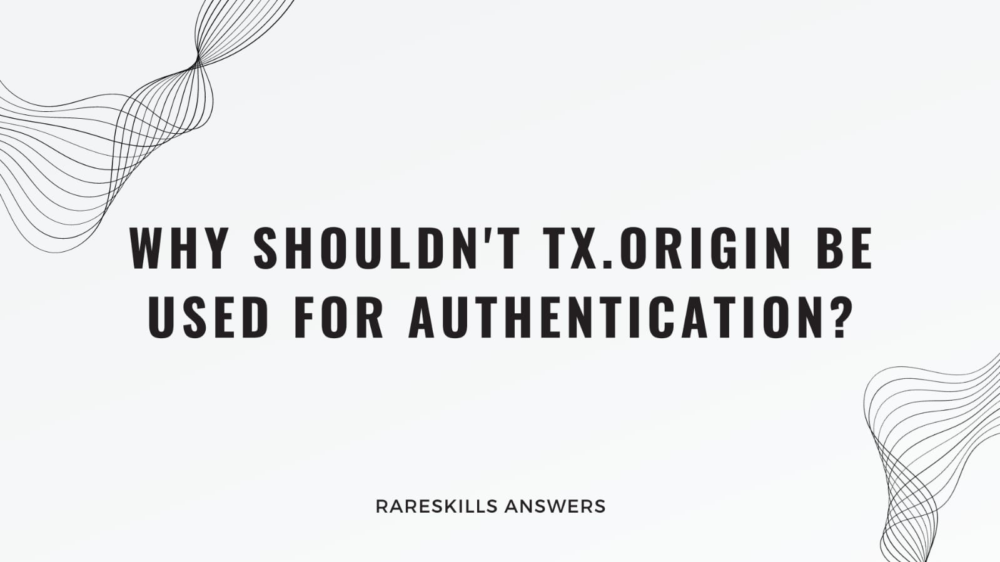

# RareSkills Solidity Interview Question #5 Answered: What special CALL is required for proxies to work?

This series will provide answers to the list of [Solidity interview questions](https://www.rareskills.io/post/solidity-interview-questions) that were published by [RareSkills.](https://www.rareskills.io/).



## *Question 11 (Easy): Why shouldn’t tx.origin be used for authentication?*

**Answer:** `tx.origin` shouldn’t be used for authentication because an attacker could execute a phishing attack and authenticate as `tx.origin`. Since `tx.origin` is the address that initiated the transaction, an attacker could influence a user to execute a malicious transaction on the attacker’s contract and then call a function to authenticate on the target contract. In this scenario, `tx.origin` is the victim’s address and the target contract would authenticate the request and allow the attacker to execute transactions as if the attacker were `tx.origin`.

## Demonstration:

```solidity
// SPDX-License-Identifier: MIT
pragma solidity 0.8.21;

/**
 *  This is the target contract that uses `tx.origin` for authentication.
 *  This is problematic because `tx.origin` represents the original
 *  sender of the transaction and can be exploited by an attacker.
 */
contract TargetContract {
    address public owner;

    constructor() {
        // Set the owner to be the account that deploys the contract.
        owner = msg.sender;
    }

    function changeOwner() external {
        /**
         *  This check is vulnerable! If a different contract calls this
         *  function, tx.origin would still refer to the original user who
         *  initiated the transaction, not the contract that's currently
         *  calling this function.
         */
        require(tx.origin == owner, "Only the owner can change ownership");

        // This could be set to the attacker's contract.
        owner = msg.sender;
    }
}

/*
 *  This is the attacker's contract.
 *  It is designed to exploit the TargetContract's use of `tx.origin`.
 */
contract AttackerContract {
    TargetContract targetContract;  // Reference to the TargetContract.

    constructor(address _victimAddress) {
        // Initialize with the address of the TargetContract.
        targetContract = TargetContract(_victimAddress);
    }

    /*
     * This function will be used to trick the owner of TargetContract to call
     * it. When this function is called, it then calls the changeOwner()
     * function on TargetContract. Because the TargetContract's changeOwner
     * function checks tx.origin and not msg.sender, it will see the original
     * transaction initiator (the unsuspecting user) as the sender, and not
     * this contract, thereby changing the ownership to this attacker contract.
    */
    function trickTargetContractOwnerToCallThis() external {
        targetContract.changeOwner();
    }
}
```

## Further Discussion:
Due to this vulnerability, it is best practice to use `msg.sender` instead of `tx.origin`, especially for authentication, since `msg.sender` is the address that called the current function and is less susceptible to impersonation or manipulation.


Medium article: https://medium.com/coinmonks/rareskills-solidity-interview-question-11-answered-why-shouldnt-tx-origin-dfa1f4eb593c