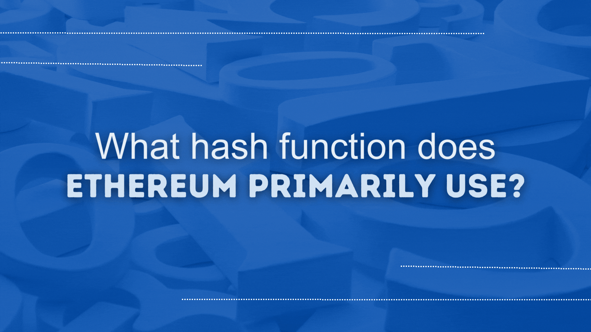

# RareSkills Solidity Interview Question #12 Answered: What hash function does Ethereum primarily use?

This series will provide answers to the list of [Solidity interview questions](https://www.rareskills.io/post/solidity-interview-questions) that were published by [RareSkills.](https://www.rareskills.io/).



## *Question #12 (Easy): What hash function does Ethereum primarily use?*

**Answer:** Ethereum primarily uses the Keccak-256 hash function. This function is used for various purposes in the Ethereum network including generating addresses, forming block hashes, creating Merkle trees, generating transaction receipts, hashing within smart contracts, hashing event signatures, signature generation and verification, etc…

## Demonstration:

```solidity
// SPDX-License-Identifier: MIT
pragma solidity ^0.8.21;

contract SimpleHasher {

    /**
     * @notice Computes the keccak256 hash of the given input data.
     * @param data The input string to hash.
     * @return The keccak256 hash of the input string.
     */
    function computeHash(string memory data) public pure returns(bytes32) {
        return keccak256(abi.encodePacked(data));
    }
}
```

## Further Discussion:

While Keccak-256 is used for most core operations within the network, Ethereum uses other cryptographic functions and mechanisms such as Elliptic Curve Digital Signature Algorithm (ECDSA), SHA-256, RIP-EMD160 and BLS Signatures. For example: ECDSA is used for generating and verifying digital signatures in Ethereum; RIP-EMD160 can be used in combination with SHA-256 in the process of creating an Ethereum address from a Bitcoin public key for interoperability; BLS signatures allow for aggregation of validator signatures, which is more efficient and can lead to scalability improvements.

Medium article: https://medium.com/@fbyrd/rareskills-solidity-interview-question-12-answered-what-hash-function-does-ethereum-primarily-use-bfc34ff7680a