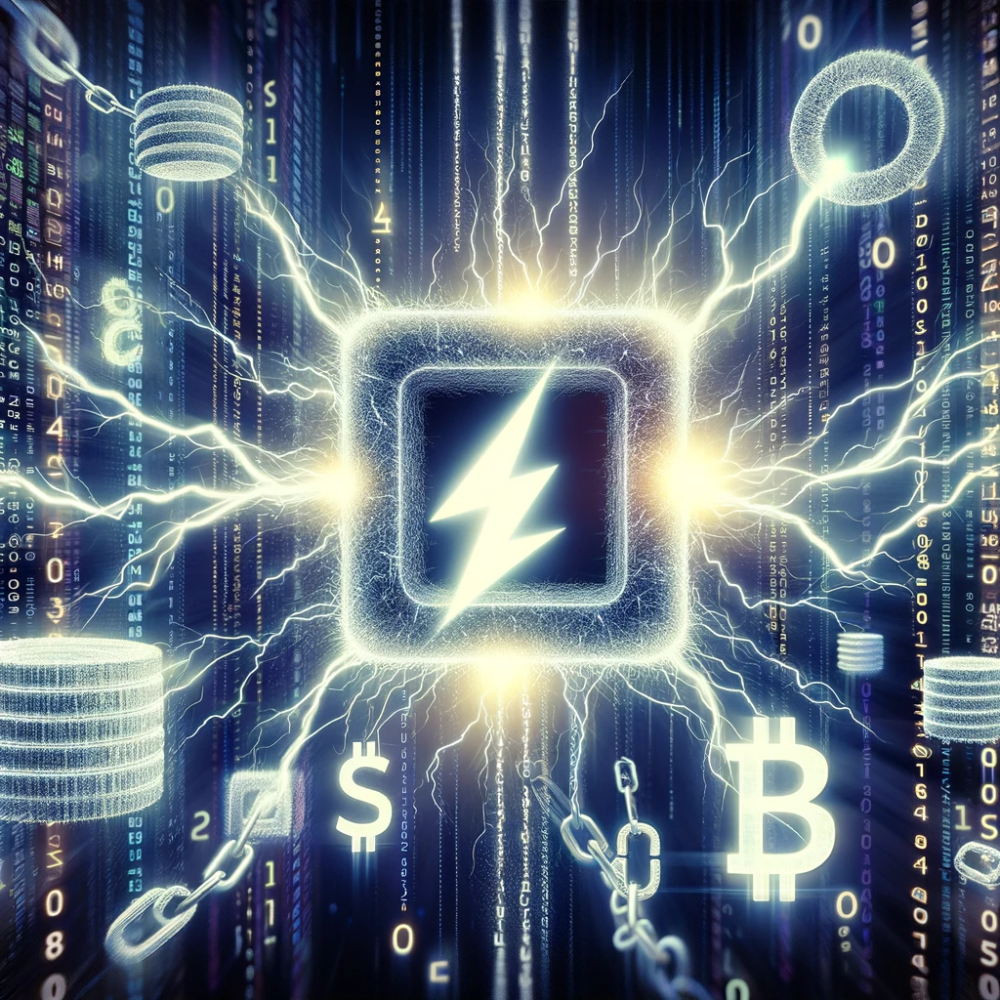

# RareSkills Solidity Interview Question #16 Answered: What is a flash loan?

This series will provide answers to the list of [Solidity interview questions](https://www.rareskills.io/post/solidity-interview-questions) that were published by [RareSkills.](https://www.rareskills.io/).



## _Question #16 (Easy): What is a flash loan?_

**Answer:** A flash loan is a loan offered by a smart contract that has to be paid back within the same transaction. These loans allow smart contracts to lend an amount of tokens without a requirement for collateral. A typical sequence for a flash loan is:

-   A flash loan borrower calls a function on a lender smart contract to initiate a flash loan.
-   The lender sends the assets to the borrower.
-   The lender checks that the assets (plus an optional fee) are returned by the end of the function call.

## Demonstration:

```solidity
// SPDX-License-Identifier: MIT
pragma solidity 0.8.23;

import { IERC20 } "./IERC20.sol";

interface IERC3156FlashLender {
    /**
     * @dev The amount of currency available to be lent.
     * @param token The loan currency.
     * @return The amount of `token` that can be borrowed.
     */
    function maxFlashLoan(
        address token
    ) external view returns (uint256);

    /**
     * @dev The fee to be charged for a given loan.
     * @param token The loan currency.
     * @param amount The amount of tokens lent.
     * @return The amount of `token` to be charged for the loan, on top of the returned principal.
     */
    function flashFee(
        address token,
        uint256 amount
    ) external view returns (uint256);

    /**
     * @dev Initiate a flash loan.
     * @param receiver The receiver of the tokens in the loan, and the receiver of the callback.
     * @param token The loan currency.
     * @param amount The amount of tokens lent.
     * @param data Arbitrary data structure, intended to contain user-defined parameters.
     */
    function flashLoan(
        IERC3156FlashBorrower receiver,
        address token,
        uint256 amount,
        bytes calldata data
    ) external returns (bool);
}

contract FlashLender is IERC3156FlashLender {
    IERC20 public token;
    uint256 public fee;

    constructor(address _tokenAddress, uint256 _fee) {
        token = IERC20(_tokenAddress);
    }

    // Calculate the flash loan fee
    function flashFee(address _token, uint256 _amount)
      external view override returns (uint256) {
        require(_token == address(token), "FlashLender: Unsupported token");

        return (_amount * fee) / 10000;
    }

    // Return the maximum amount available for the flash loan
    function maxFlashLoan(
      address _token
    ) external view override returns (uint256) {
        if (_token == address(token)) {
            return token.balanceOf(address(this));
        } else {
            return 0;
        }
    }

    // Execute the flash loan
    function flashLoan(
      IERC3156FlashBorrower _borrower,
      address _token,
      uint256 _amount,
      bytes calldata _data
    ) external override returns (bool) {
        require(_token == address(token), "FlashLender: Unsupported token");

        uint256 balanceBefore = token.balanceOf(address(this));

        require(
          balanceBefore >= _amount,
          "FlashLender: Insufficient liquidity"
        );

        uint256 feeAmount = flashFee(_token, _amount);

        token.transfer(address(_borrower), _amount);

        require(
          _borrower.onFlashLoan(
            msg.sender,
            _token,
            _amount,
            feeAmount,
            _data
          ) == keccak256("ERC3156FlashBorrower.onFlashLoan"),
          "FlashLender: Callback failed"
        );

        uint256 repaymentAmount = _amount + feeAmount;

        require(
          token.transferFrom(
            address(_borrower),
            address(this),
            repaymentAmount
          ),
          "FlashLender: Repayment failed"
        );

        assert(token.balanceOf(address(this)) == balanceBefore + feeAmount);

        return true;
    }
}

interface IERC3156FlashBorrower {
    /**
     * @dev Receive a flash loan.
     * @param initiator The initiator of the loan.
     * @param token The loan currency.
     * @param amount The amount of tokens lent.
     * @param fee The additional amount of tokens to repay.
     * @param data Arbitrary data structure, intended to contain user-defined parameters.
     * @return The keccak256 hash of "ERC3156FlashBorrower.onFlashLoan"
     */
    function onFlashLoan(
        address initiator,
        address token,
        uint256 amount,
        uint256 fee,
        bytes calldata data
    ) external returns (bytes32);
}

contract FlashBorrower is IERC3156FlashBorrower {
    IERC3156FlashLender public lender;
    address public initiator;
    address public token;
    uint256 public amount;
    uint256 public fee;

    constructor(address _lender) {
        lender = IERC3156FlashLender(_lender);
    }

    // Function to initiate a flash loan
    function initiateFlashLoan(address _token, uint256 _amount) external {
        token = _token;
        amount = _amount;
        fee = lender.flashFee(_token, _amount);
        uint256 repayment = _amount + fee;

        IERC20(_token).approve(address(lender), repayment);

        lender.flashLoan(this, _token, _amount, "");
    }

    // Callback function required by the flash loan interface
    function onFlashLoan(
      address _initiator,
      address _token,
      uint256 _amount,
      uint256 _fee,
      bytes calldata
    ) external override returns (bytes32) {
        require(
          msg.sender == address(lender),
          "FlashBorrower: Untrusted lender"
        );
        require(
          _token == token && _amount == amount && _fee == fee,
          "FlashBorrower: Invalid loan data"
        );

        // Add logic to utilize the flash loan here
        // ...

        return keccak256("ERC3156FlashBorrower.onFlashLoan");
    }
}
```

## Further Discussion:

There have been many approaches to adopting flash loans. For example, some protocols pull the repayment from the borrower, while others expect borrowers to manually send the repayment. Some protocols allow for borrowers to repay the loan with different tokens, among other varying methods…

Standardization was introduced in ERC-3156, which provides interfaces and processes for the safe execution of single-asset flash loans. This enables protocols and borrowers to have a mutual understanding of implementation details. For example, the standard specifies that the flash loan contract must pull the repayment from the receiver, the flash borrower must return `keccak256("ERC3156FlashBorrower.onFlashLoan")`, etc…

Protocols could still decide to accept repayment in a different token, however, it is not a standard aspect of ERC-3156.

Medium article: https://medium.com/@fbyrd/rareskills-solidity-interview-question-16-answered-what-is-a-flash-loan-d5d419139bd5
