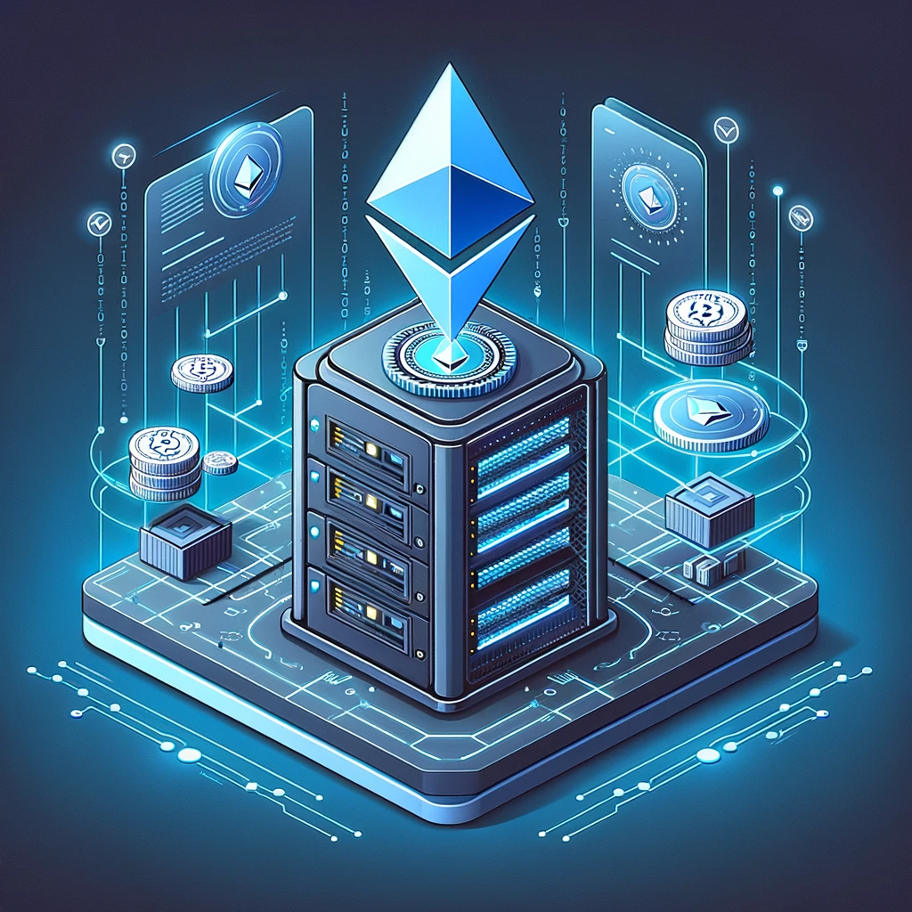

# RareSkills Solidity Interview Question #18 Answered: What is the minimum amount of Ether required to run a solo staking node?

This series will provide answers to the list of [Solidity interview questions](https://www.rareskills.io/post/solidity-interview-questions) that were published by [RareSkills.](https://www.rareskills.io/).

## *Question #18 (Easy): What is the minimum amount of Ether required to run a solo staking node?*

**Answer:** The minimum amount of Ether required to run a solo staking node is 32 ETH.

## Demonstration:

The steps to solo staking, as outlined by [ethereum.org](ethereum.org) are:

1. Get some hardware: You need to run a node to stake

2. Sync an execution layer client

3. Sync a consensus layer client

4. Generate your keys and load them into your validator client

5. Monitor and maintain your node

## Further Discussion:

There are other methods of staking Ether that require less capital and/or does not require one to operate their own node. Some other ways to stake Ether are:

- **Staking as a service (SaaS)**: Staking as a service represents a service that allows for stakers to deposit their own 32 ETH for a validator and delegate node operations to a third-party operator. This process typically involves the staker going through the validator setup, including key generation and deposit, and then uploading their signing keys to the operator. This allows the service to operate the validator on the staker’s behalf, usually for a monthly fee.
- **Pooled staking**: Also known as “liquid staking” is a collaborative approach that allows for people to pool their ETH together in order to obtain the 32 ETH required to activate a set of validator keys. Many staking pools provide a token that represents a claim on the staked ETH.
- **Centralized exchanges**: There are centralized exchanges that offer services allowing users to stake their ETH. This approach typically does not require users to hold their own keys, as the exchange manages their keys instead.

There are pros and cons to each approach and those interested in staking should weigh each option.

Medium article: https://medium.com/@fbyrd/rareskills-solidity-interview-question-18-answered-what-is-the-minimum-amount-of-ether-required-a024dc6f2665