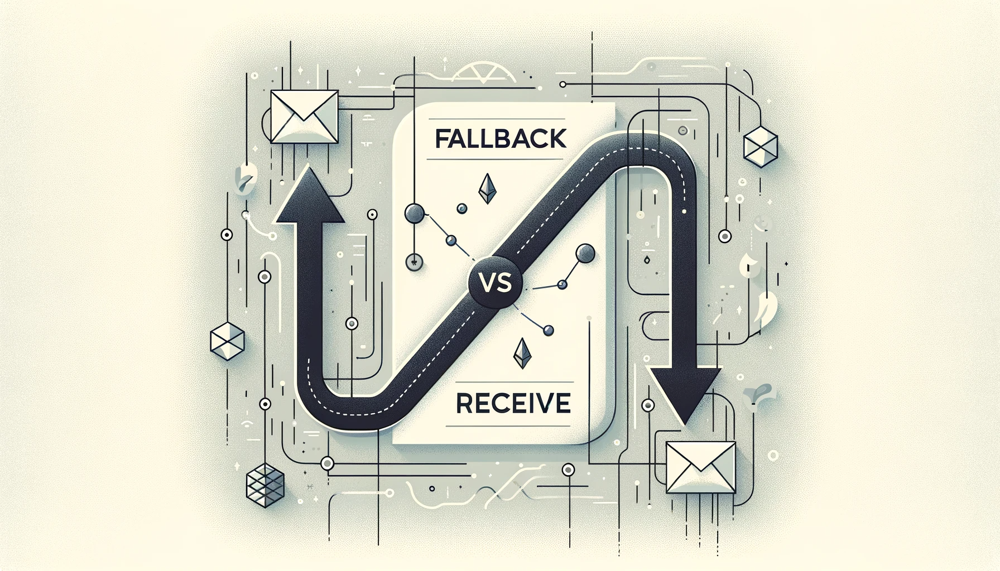

# RareSkills Solidity Interview Question #19 Answered: What is the difference between fallback and receive?

This series will provide answers to the list of [Solidity interview questions](https://www.rareskills.io/post/solidity-interview-questions) that were published by [RareSkills.](https://www.rareskills.io/).



## *Question #19 (Easy): What is the difference between fallback and receive?*

**Answer:** The difference between `fallback` and `receive` is that `receive` is executed on a call to the contract with empty calldata and `fallback` is executed on a call to the contract when no function selector matches the function selector given in the calldata, or if the calldata was empty and there is no `receive` function. Another difference is that there is only one version of `receive` and there are multiple versions of `fallback` that can be declared (one per contract). Also, `receive` must be declared as `payable` while `fallback` is optionally `payable` (true as of the latest version 0.8.24).

## Demonstration:

```solidity
// SPDX-License-Identifier: MIT
pragma solidity 0.8.24;

contract TestPayable {
    uint256 public x;
    uint256 public y;

    /**
     * This function is called for all messages sent to this contract, except
     * plain Ether transfers (there is no other function except the receive
     * function). Any call with non-empty calldata to this contract will
     * execute the fallback function (even if Ether is sent along with the
     * call).
     */
    fallback() external payable {
        x = 1;
        y = msg.value;
    }

    /**
     * This function is called for plain Ether transfers, i.e.
     * for every call with empty calldata.
     */
    receive() external payable {
        x = 2;
        y = msg.value;
    }

    /**
     * Commented out since only one fallback function can de declared in the
     * contract. However, this is also a valid declaration of a fallback
     * function that accepts `bytes calldata` as input and returns `bytes
     * memory`.
     */
    /* fallback (bytes calldata input) external payable returns (bytes memory) {
        x = 3;
        y = msg.value;

        return input;
    }*/
}
```

## Further Discussion:

Although a payable `fallback` function can be used to receive Ether, this method is not recommended since it would not fail due to interface confusions on the part of the sender. For example, if a user mistakenly sends Ether with a call to a contract function that does not exist, the payable `fallback` function would receive the Ether and not revert the transaction. This could result in a bad user experience due to a loss of funds.

Medium article: https://medium.com/coinmonks/rareskills-solidity-interview-question-19-answered-what-is-the-difference-between-fallback-and-0e3721e89eff