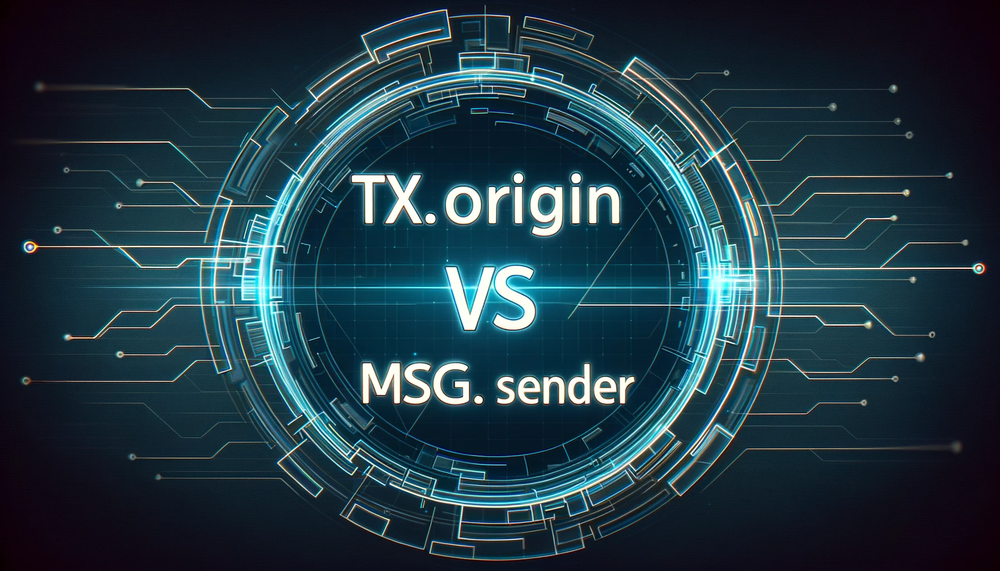

# RareSkills Solidity Interview Question #23 Answered: What is the difference between tx.origin and msg.sender?

This series will provide answers to the list of [Solidity interview questions](https://www.rareskills.io/post/solidity-interview-questions) that were published by [RareSkills.](https://www.rareskills.io/).



## *Question #23 (Easy): What is the difference between tx.origin and msg.sender?*

**Answer:** The difference between `tx.origin` and `msg.sender` is that `tx.origin` is the address that initiated the transaction while msg.sender is the immediate address that sent the current function call that’s being processed. Another difference is that `tx.origin` is always an EOA (Externally Owned Account), while `msg.sender` can be an EOA or a contract. For example, if an EOA calls a contract’s function and that function calls a function on another contract via call, from the perspective of the second contract, the `tx.origin` would be the EOA while the `msg.sender` would be the address of the first contract.

## Demonstration:

```solidity
// SPDX-License-Identifier: MIT
pragma solidity 0.8.24;

/**
 * This is the target contract that uses `tx.origin` for authentication.
 * This is problematic because `tx.origin` represents the original
 * sender of the transaction and can be exploited by an attacker.
*/
contract Authenticator {
    address public owner;

    constructor() {
        // Set the owner to be the account that deploys the contract.
        owner = msg.sender;
    }

    function changeOwner() external {
        /**
         * This check is vulnerable! If a different contract calls this
         * function, tx.origin would still refer to the original user who
         * initiated the transaction, not the contract that's currently calling
         * this function.
         */
        require(tx.origin == owner, "Only the owner can change ownership");

        // This could be set to the attacker's contract.
        owner = msg.sender;
    }
}

contract AttackerContract {
    Authenticator authenticator;

    constructor(address _authenticator) {
        authenticator = Authenticator(_authenticator);
    }

    /**
     * This function will be used to trick the owner of Authenticator to call
     * it. When this function is called, it then calls the changeOwner()
     * function on Authenticator. Because Authenticator's changeOwner function
     * checks tx.origin and not msg.sender, it will see the original
     * transaction initiator (the unsuspecting user) as the sender, and not
     * this contract, thereby changing the ownership to this attacker contract.
     */
    function trickAuthenticatorContractOwnerToCallThis() external {
        authenticator.changeOwner();
    }
}
```

## Further Discussion:

It’s important to note that relying on `tx.origin` for authentication purposes is discouraged because it can make contracts vulnerable to phishing attacks. This is because the `tx.origin` does not change during the entire transaction execution, regardless of how many contracts call each other.

Therefore, if an attacker was able to get a user to call a malicious contract, the attacker could authenticate as `tx.origin` on the authenticating contract.

For this reason, it is better to use `msg.sender` for authentication purposes to help ensure the immediate caller is the address that is undergoing authentication.

Medium article: https://medium.com/@fbyrd/rareskills-solidity-interview-question-23-answered-what-is-the-difference-between-tx-origin-5f0db2067c0b