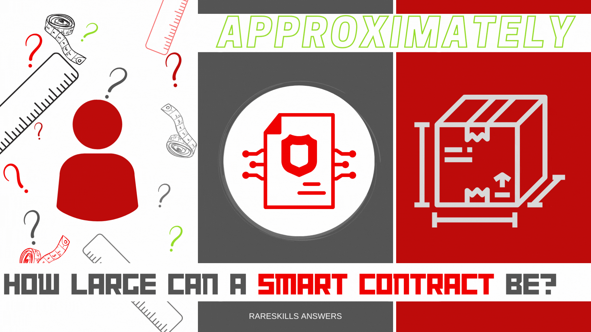

# RareSkills Solidity Interview Question #2 Answered: Approximately, how large can a smart contract be?

This series will provide answers to the list of [Solidity interview questions](https://www.rareskills.io/post/solidity-interview-questions) that were published by [RareSkills.](https://www.rareskills.io/).



## *Question #2 (Easy): Approximately, how large can a smart contract be?*

**Answer:** The Solidity max contract size is 24,576 bytes. This contract code size limit was introduced in EIP-170 with the Spurious Dragon hard-fork. The purpose of this limit is to prevent denial-of-service (DOS) attacks.

## Demonstration:

```solidity
// SPDX-License-Identifier: GPL-3.0
pragma solidity 0.8.21;

// Import a lot of libraries, contracts, etc...

contract MaxCodeSizeDemo {
    function func1() public pure returns(uint256) {
        return 1;
    }

    // Add similar functions up to funcN
    // ...

    function func4096() public pure returns(uint256) {
        return 4096;
    }

    /**
     * ...and so on... until eventually, the contract size will
     * exceed 24,576 bytes and an attempt to deploy will
     * show an error similar to:
     *
     * Warning: Contract code size exceeds 24576 bytes (a limit
     * introduced in Spurious Dragon). This contract may not be
     * deployable on Mainnet. Consider enabling the optimizer (with
     * a low "runs" value!), turning off revert strings, or using libraries.
     */

}
```

## Further Discussion:

The Solidity maximum contract size addresses what the EIP calls a “slight quadratic vulnerability in Ethereum”. The problem is that even though nodes are compensated through gas fees when executing transactions, these gas fees only pay for the immediate computational work that the node performs. Nodes incur additional computational costs through storage of the contract’s byte-code, reading the contract’s byte-code from disk, preprocessing the code for VM execution and Merkle proof generation.

After a contract is deployed, the node is not directly compensated for these additional computations so the deployer’s transaction costs can be disproportionate to the node’s long-term cost, particularly if there is no limit on the size of contracts. Thus, without a maximum contract size, an attacker could deploy and interact with large contracts in a way designed to maximize computational work for nodes, effectively conducting a DoS attack.

(Technically, this type of attack is still possible with a maximum contract size, however, it would be more difficult to execute because the resource costs for any single contract are bounded and easier to manage computationally. Thus, the attacker would need to deploy multiple large contracts and the cost to execute the same attack may likewise be multiplied.)

Medium story: https://medium.com/coinsbench/rareskills-solidity-interview-question-2-answered-2d2a8fabd834