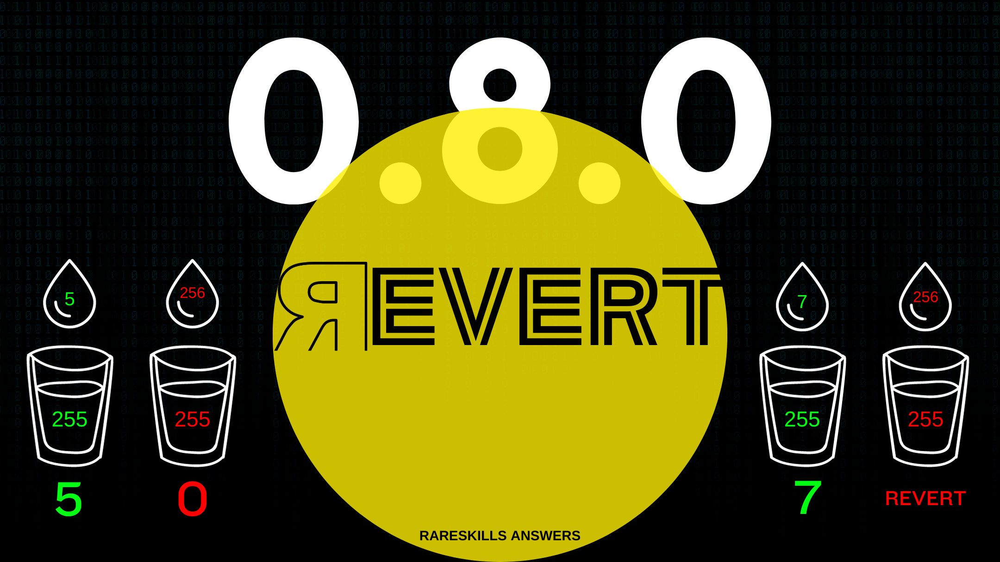

# RareSkills Solidity Interview Question #4 Answered: What major change with arithmetic happened with Solidity 0.8.0?

This series will provide answers to the list of [Solidity interview questions](https://www.rareskills.io/post/solidity-interview-questions) that were published by [RareSkills.](https://www.rareskills.io/).



## *Question #4 (Easy): What major change with arithmetic happened with Solidity 0.8.0?*

**Answer:** Starting with version 0.8.0, Solidity automatically includes checks for arithmetic underflows and overflows as a built-in feature of the language. Before version 0.8.0, integer underflows and overflows were allowed and would not cause an error. Since version 0.8.0, Solidity will revert if an expression causes an integer underflow or overflow.

## Demonstration:

```solidity
// SPDX-License-Identifier: GPL-3.0
pragma solidity 0.7.6;

contract Overflow {
    uint256 public number = type(uint256).max;

    function increment() external {
        // The transaction succeeds and updates the value to 0;
        number++;
    }
}
// SPDX-License-Identifier: GPL-3.0
pragma solidity 0.8.0;

contract Overflow {
    uint256 public number = type(uint256).max;

    function increment() external {
        // This causes the transaction to revert
        number++;
    }
}
```

## Further Discussion:

Before Solidity included underflow and overflow checking natively, developers would have to add manual checks or import a library to handle such scenarios. OpenZeppelin’s SafeMath provided arithmetic functions with underflow and overflow checks and was a popular library among developers. This library has been removed now that Solidity has included this protection since version 0.8.0.

Medium story: https://medium.com/@fbyrd/rareskills-solidity-interview-question-4-answered-what-major-change-with-arithmetic-happened-with-abbd13c700d0