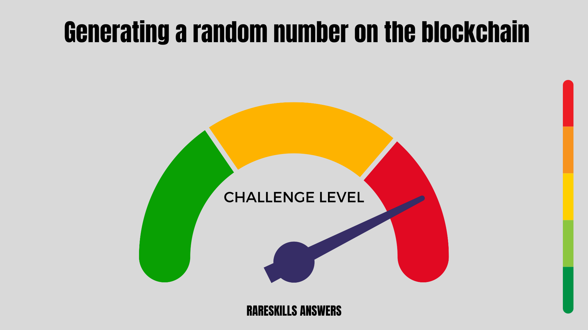

# RareSkills Solidity Interview Question #7 Answered: What are the challenges of creating a random number on the blockchain?

This series will provide answers to the list of [Solidity interview questions](https://www.rareskills.io/post/solidity-interview-questions) that were published by [RareSkills.](https://www.rareskills.io/).



## *Question #7 (Easy): What are the challenges of creating a random number on the blockchain?*

**Answer:** Random number generation on the blockchain is difficult because of its deterministic and public nature. The Ethereum Virtual Machine (EVM) must produce the same output given the same input, and all data on the blockchain is public. Therefore, it is possible to determine the “random number” by copying its generation formula and reading the inputs from the blockchain.

## Demonstration:

```solidity
// SPDX-License-Identifier: GPL-3.0
pragma solidity 0.8.21;

contract GuessRandomNumber {
    // Prize amount for anyone who can guess the random number
    uint256 prize = 1_000_000 ether;

    constructor() payable {
        // Make sure the deployer funds the contract with the prize amount
        require(msg.value == prize);
    }

    function guess(uint256 _guess) public {
        // Generate "random number" using block data
        uint256 randomNumber = uint256(keccak256(abi.encodePacked(block.number, block.timestamp)));

        if (_guess == randomNumber) {
            // Send prize to the guesser who "guessed" correctly
            (bool sent, ) = msg.sender.call{ value: prize }("");

            require(sent, "Fail to send to msg.sender");
        }
    }
}

contract PredictRandomNumber {
    GuessRandomNumber public guessRandomNumber;

    receive() external payable {}

    function predictRandomNumber() public {
        // Copy the formula that generates the "random number"
        // This will match the random number since the block data will be the
        // same as in the original formula
        uint256 prediction = uint256(keccak256(abi.encodePacked(block.number, block.timestamp)));

        // Submit the prediction
        guessRandomNumber.guess(prediction);
    }

    function withdraw() external {
      // Logic to withdraw prize
    }
}
```

## Further Discussion:

Contracts that attempt to create random numbers on-chain and use them in business logic suffer from Insufficient Randomness. To obtain a more secure and unpredictable random number, it is best practice to use a trusted oracle (Chainlink is a popular choice) that will generate the number off-chain. This helps to protect against attackers being able to predict the number.

Medium article: https://coinsbench.com/rareskills-solidity-interview-question-7-answered-what-are-the-challenges-of-creating-a-random-be402825c722#7ced-ce2d3219087d