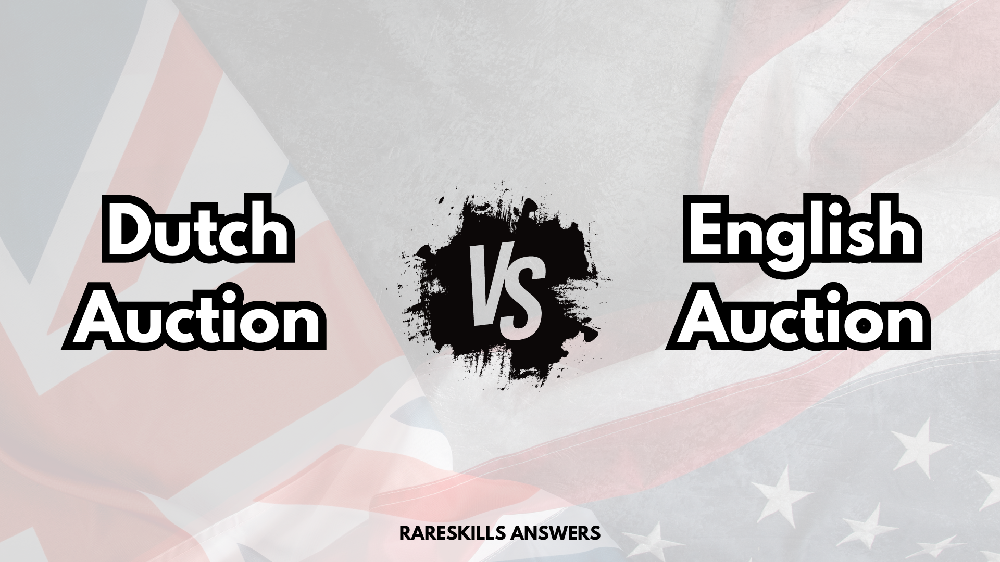

# RareSkills Solidity Interview Question #8 Answered: What is the difference between a Dutch Auction and an English Auction?

This series will provide answers to the list of [Solidity interview questions](https://www.rareskills.io/post/solidity-interview-questions) that were published by [RareSkills.](https://www.rareskills.io/).



## *Question #8 (Easy): What is the difference between a Dutch Auction and an English Auction?*

**Answer:** In a Dutch Auction, the auction price starts high and continuously decreases over time until a bidder submits a bid that meets or exceeds the current price, which wins the auction. In an English auction, the auction price starts low and increases over time as bidders outbid one another until the auction ends, where the highest bidder wins.

## Demonstration:

```solidity
// SPDX-License-Identifier: MIT
pragma solidity 0.8.21;

contract DutchAuction {
    address public owner;
    uint256 public startTime;
    uint256 public endTime;
    uint256 public startPrice;
    uint256 public minPrice;
    uint256 public duration;
    bool public ended;

    uint256 public priceDropPerMinute;

    event AuctionEnded(address winner, uint256 price);

    constructor(
        uint256 _startPrice,
        uint256 _minPrice,
        uint256 _durationMinutes
    ) {
        owner = msg.sender;
        startPrice = _startPrice;
        minPrice = _minPrice;
        duration = _durationMinutes * 60; // Convert minutes to seconds
        startTime = block.timestamp;
        endTime = startTime + duration;
        ended = false;

        require(
          _startPrice > _minPrice,
          "Start price must be greater than minimum price"
        );
        require(_durationMinutes > 0, "Duration must be greater than zero");

        priceDropPerMinute = (startPrice - minPrice) / _durationMinutes;
    }

    modifier onlyOwner() {
        require(msg.sender == owner, "Only the owner can call this function");
        _;
    }

    modifier auctionOngoing() {
        require(!ended, "Auction already ended");
        require(block.timestamp <= endTime, "Auction time has passed");
        _;
    }

    function getCurrentPrice() public view auctionOngoing returns (uint256 currentPrice) {
        uint256 elapsedMinutes = (block.timestamp - startTime) / 60;
        currentPrice = startPrice - (priceDropPerMinute * elapsedMinutes);
    }

    function bid() public payable auctionOngoing {
        uint256 currentPrice = getCurrentPrice();

        require(
          msg.value >= currentPrice,
          "Bid is less than the current price"
        );

        emit AuctionEnded(msg.sender, currentPrice);

        // End the auction
        ended = true;

        // Refund any excess funds sent
        if (msg.value > currentPrice) {
            (bool sent, ) = payable(msg.sender).call{ value: msg.value - currentPrice }("");
        }
    }

    function withdraw() public onlyOwner {
        require(block.timestamp > endTime, "Auction has not ended yet");

        // Transfer the bid to the owner
        (bool sent, ) = payable(owner).call{ value: address(this).balance }("");

        require(sent, "Failed to withdraw funds");
    }
}
// SPDX-License-Identifier: MIT
pragma solidity 0.8.21;

contract EnglishAuction {
    address public owner;
    uint256 public startTime;
    uint256 public endTime;
    uint256 public startPrice;
    address public highestBidder;
    uint256 public highestBid;

    event NewBid(address indexed bidder, uint256 amount);

    constructor(uint256 _startPrice, uint256 _durationInSeconds) {
        owner = msg.sender;
        startTime = block.timestamp;
        endTime = startTime + _durationInSeconds;
        startPrice = _startPrice;
        highestBid = _startPrice;
    }

    modifier onlyOwner() {
        require(msg.sender == owner, "Only the owner can call this function");
        _;
    }

    modifier onlyBeforeEnd() {
        require(block.timestamp <= endTime, "Auction has ended");
        _;
    }

    modifier onlyAfterStart() {
        require(block.timestamp >= startTime, "Auction hasn't started yet");
        _;
    }

    function bid() public payable onlyBeforeEnd onlyAfterStart {
        require(
          msg.value > highestBid,
          "Bid must be higher than the current highest bid"
        );

        // Refund the previous highest bidder
        if (highestBidder != address(0)) {
            (bool sent, ) = payable(highestBidder).call{ value: highestBid }("");
        }

        // Update highest bidder and bid
        highestBidder = msg.sender;
        highestBid = msg.value;

        emit NewBid(msg.sender, msg.value);
    }

    function withdraw() public onlyOwner {
        require(block.timestamp > endTime, "Auction has not ended yet");

        // Transfer the highest bid to the owner
        (bool sent, ) = payable(owner).call{ value: address(this).balance }("");

        require(sent, "Failed to withdraw funds");
    }
}
```

## Further Discussion:

To avoid a denial-of-service attack in an English auction smart contract, it is best practice to not require that the call to the previous highest bidder succeeds. This is because an attacker could become the highest bidder and cause the refund call to their address to always fail. Such an attack would prevent any new bidder from becoming the highest bidder and essentially lock the auction.

Medium article: https://medium.com/@fbyrd/rareskills-solidity-interview-question-8-answered-what-is-the-difference-between-a-dutch-auction-109d35794e6f