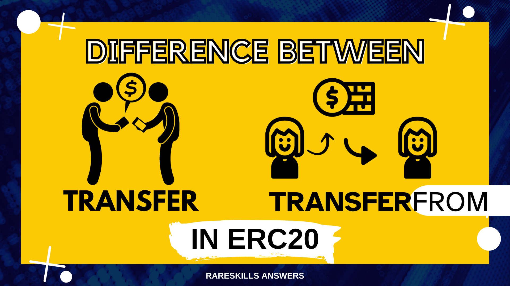

# RareSkills Solidity Interview Question #9 Answered: What is the difference between transfer and transferFrom in ERC20?

This series will provide answers to the list of [Solidity interview questions](https://www.rareskills.io/post/solidity-interview-questions) that were published by [RareSkills.](https://www.rareskills.io/).



## *Question #9 (Easy): What is the difference between transfer and transferFrom in ERC20?*

**Answer:** In ERC20, the `transfer` function is called to transfer a token amount from `msg.sender` to a destination address. The `transferFrom` function is called to transfer a token amount from a specified source address to a destination address. For the `transferFrom` call to be successful, the source address must first give an allowance for `msg.sender` to be able to spend (at least) the transfer amount.

## Demonstration:

```solidity
// SPDX-License-Identifier: MIT
pragma solidity 0.8.21;

import { IERC20 } from "@openzeppelin/contracts/token/ERC20/IERC20.sol";

/**
 * @title SimpleERC20
 * @notice A simplified ERC20 contract for demonstration purposes
 * @dev This contract is not intended for production use
 */
contract SimpleERC20 is IERC20 {
    mapping(address => uint256) public balanceOf;
    mapping(address => mapping(address => uint256)) public allowance;

    uint256 public totalSupply = 10000 * (10 ** 18);

    constructor() {
        // Initialize the balance of the contract deployer
        balanceOf[msg.sender] = totalSupply;
    }

    /**
     * @notice Transfers tokens from the caller to a given address
     * @dev This function emits the Transfer event
     * @param to Address to send tokens to
     * @param value Amount of tokens to send
     * @return success True if the transfer was successful
     */
    function transfer(address to, uint256 value) public returns (bool success) {
        // Check if the sender has enough balance
        require(balanceOf[msg.sender] >= value, "Insufficient balance");

        // Perform the transfer
        balanceOf[msg.sender] -= value;
        balanceOf[to] += value;

        // Emit the Transfer event
        emit Transfer(msg.sender, to, value);

        return true;
    }

    /**
     * @notice Approves a spender to spend tokens on behalf of the caller
     * @dev This function emits the Approval event
     * @param spender Address to approve
     * @param value Amount of tokens to approve
     * @return success True if the approval was successful
     */
    function approve(address spender, uint256 value) public returns (bool success) {
        // Set the allowance
        allowance[msg.sender][spender] = value;

        // Emit the Approval event
        emit Approval(msg.sender, spender, value);

        return true;
    }

    /**
     * @notice Transfers tokens from one address to another (requires approval)
     * @dev This function emits the Transfer event
     * @param from Address to send tokens from
     * @param to Address to send tokens to
     * @param value Amount of tokens to send
     * @return success True if the transfer was successful
     */
    function transferFrom(address from, address to, uint256 value) public returns (bool success) {
        // Check if the from address has enough balance
        require(value <= balanceOf[from], "Insufficient balance");

        // Check if the spender is allowed to spend the amount
        require(value <= allowance[from][msg.sender], "Allowance exceeded");

        // Perform the transfer
        balanceOf[from] -= value;
        balanceOf[to] += value;

        // Update the allowance
        allowance[from][msg.sender] -= value;

        // Emit the Transfer event
        emit Transfer(from, to, value);

        return true;
    }

    ...
}
```

## Further Discussion:

The `transferFrom` function takes a from parameter that is not present in transfer . In `transfer`, `msg.sender` is the implied source address.

So while `transfer` and `transferFrom` are both used to transfer ERC20 tokens, they serve different purposes.

Medium article: https://medium.com/coinmonks/rareskills-solidity-interview-question-9-answered-what-is-the-difference-between-transfer-and-82bf593d5b30